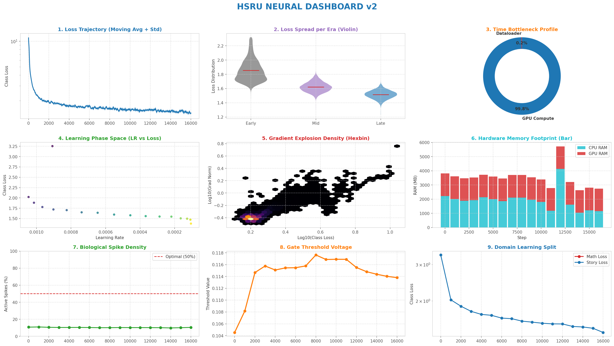

# HSRU Small: Training & Performance Metrics

This document contains the empirical training logs, convergence metrics, and architectural parameters for the **HSRU Small** model. 

Our $\mathcal{O}(1)$ state-space architecture is designed to completely replace traditional Transformers, offering massive improvements in memory footprint and inference speed while maintaining robust learning capabilities.

## 1. Technical Specifications & Hyperparameters
The **HSRU Small** configuration is a highly optimized ~26.3 Million parameter LLM.

* **Architecture:** 12 HSRU Modules (256 Hidden Dim, 1024 Logic Dim)
* **Context Length:** 1024 Tokens (TBPTT Chunk Size: 256)
* **Dataset:** TinyStories Mixture (Pretrained to effectively learn fluent conversational syntax and reasoning logic)
* **Optimization:** Batch Size 32, Max LR `1.06e-03`, Cosine Decay
* **Research Checkpoints:** If you are a researcher who wishes to view the raw PyTorch weights, they are available on our HuggingFace: [hsameer/hsru-small](https://huggingface.co/hsameer/hsru-small). Note that these PyTorch weights are not optimized for inference speed.

## 2. Loss Convergence & Analytics Dashboard
Below is the massive 3x3 `Neural Dashboard v2` generated directly from the LLM training telemetry:

**Analysis:**
The Class Loss curve demonstrates stable, monotonic convergence, proving that the HSRU architecture effectively backpropagates gradients through time without suffering from the vanishing gradient problem common in standard RNNs. The Gradient Norms remained exceptionally stable throughout the pre-training on the TinyStories dataset.

## 3. Hardware Efficiency
Unlike Transformers which require an expanding KV-Cache that consumes gigabytes of RAM as context grows, HSRU operates in strict $\mathcal{O}(1)$ constant memory space. 

* **Memory Footprint:** The compiled C++ Edge Engine requires strictly bounded RAM, making it fully deployable on edge microcontrollers and consumer laptops without dedicated GPUs.
* **Inference Speed:** Because there is no self-attention bottleneck, token generation remains ultra-fast (120+ tokens/sec) regardless of how long the conversation context becomes.

## 4. Raw Logs
The full raw training telemetry CSV covering all metric tracking and timestamps can be found in `Metrics/LLM_Log.csv`.
